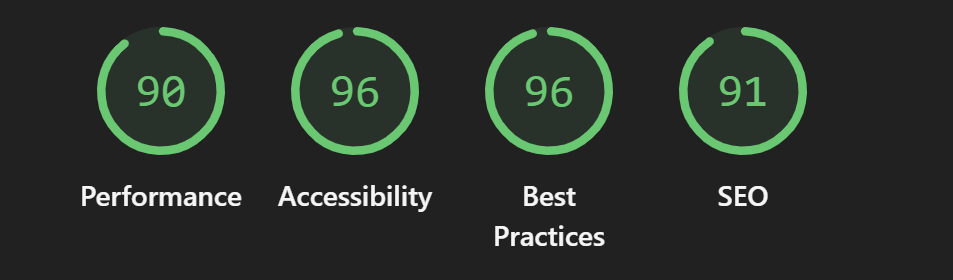

# StockVision

## Visualize Your Portfolio Performance 

Track your investments, analyze performance, and make data-driven decisions with our powerful financial dashboard.


---

## 📊 Project Overview

StockVision is a modern, interactive dashboard for investors and traders. It provides a comprehensive view of your portfolio, real-time market data, and insightful analytics to help you make smarter financial decisions.

---

## ✨ Features

- **Portfolio Overview:** Visualize your holdings and performance at a glance.
- **Market Data Center:** Access up-to-date market data and trends.
- **Performance Analytics:** Analyze your portfolio's growth and risk.
- **Recent Activity:** Track your latest transactions and changes.
- **Customizable Dashboard:** Modular components for a personalized experience.
- **Dark/Light Mode:** Seamless theme switching for your comfort.


---


---

## 🛠️ Tech Stack

- **Framework:** Next.js 
- **Language:** TypeScript
- **State Management:** React Context API
- **Deployment:** Vercel
- **Styling:** Tailwind CSS
- **UI:** Shadcn

---

## 📁 Folder Structure

```
└── app
    └── components
        ├── dashboard.tsx
        ├── DashboardPage.tsx
        ├── Index.tsx
        ├── Landing.tsx
        ├── market-data-center.tsx
        ├── NotFound.tsx
        ├── overview.tsx
        ├── performance-section.tsx
        ├── portfolio-allocation.tsx
        ├── portfolio-section.tsx
        ├── Preloader.css
        ├── Preloder.tsx
        ├── Providers.tsx
        ├── recent-activity.tsx
        ├── recent-sales.tsx
        ├── settings-section.tsx
        ├── stock-card.tsx
        ├── stock-chart.tsx
        ├── stock-ticker.tsx
        ├── summary-card.tsx
        ├── theme-provider-utils.ts
        ├── theme-provider.tsx
        ├── theme-toggle.tsx
        ├── treasury-bill-section.tsx
    └── dashboard
        ├── page.tsx
    └── data
        ├── mock-data.ts
    └── hooks
        ├── use-mobile.tsx
        ├── use-toast.ts
    └── lib
        ├── utils.ts
    └── styles
        ├── globals.css
        ├── x Theme.css
    ├── HomeClient.tsx
    ├── layout.tsx
    ├── not-found.tsx
    └── page.tsx
```

---

## 🚀 Getting Started

1. **Clone the repository**
   ```bash
   git clone https://github.com/MIHIR2006/StockVision.git
   cd StockVision
   ```
2. **Install dependencies**
   ```bash
   npm install
   # or
   bun install
   ```
3. **Run the development server**
   ```bash
   npm run dev
   # or
   bun run dev
   ```
   Open [http://localhost:3000](http://localhost:3000) to view the app in your browser.

---

## ⚡ Lighthouse 



---

## 🤝 Contributing

Contributions, issues, and feature requests are welcome!

1. Fork the repository
2. Create your feature branch (`git checkout -b feature/AmazingFeature`)
3. Commit your changes (`git commit -m 'Add some AmazingFeature'`)
4. Push to the branch (`git push origin feature/AmazingFeature`)
5. Open a Pull Request

---

